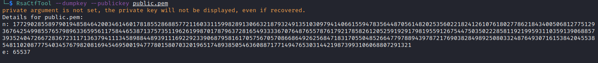
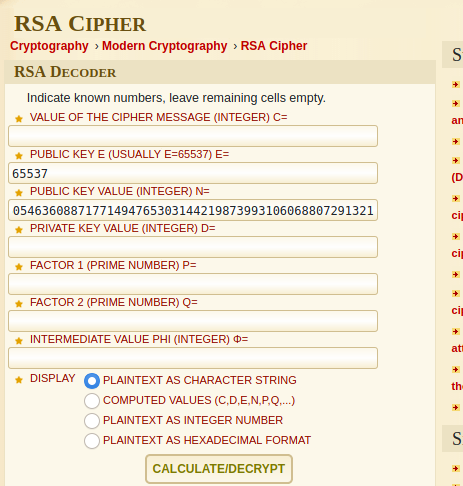
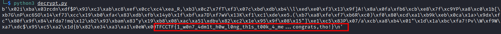

# Am i doing it right? [Crypto]

Attached file:[here](datas/AM_I_DOING_IT_RIGHT.zip)

For this challenge, we have the public key public.pem and the chall.enc file

Premierly, I wanted to use RSACTFTOOL to find D but it did not work.


So I recover the N and the E with RSACTFTOOL.



I used some tools to retrieve the p, q and d but it does not work until i tried RSa-Cipher on [Dcode](https://www.dcode.fr/rsa-cipher)




And bingo, I have the p, q and d.

So I wrote a Python script to decrypted the chall.enc file.

```Python
from Crypto.Util.number import long_to_bytes,bytes_to_long

c = open("chall.enc","rb").read()
c = bytes_to_long(c)

n = 17729028558979019485846420034614601781855286885772116033115998289130663218793249135103097941406615594783564487056148202535602218241261076180277862184340050681277512936764254998557657989633659561175844653871375735119626199870178796372816549333367076487655787617921785826120525919291798195591267544750350222858119219959311035913906885739352404726672836723117136379411134589884489391116922923390687958161705756705708668649262568471831705504852664779788943978721769038284989250803324876493071615384204553854811020877754034576798208169454695001947778015807032019651748938505463608871771494765303144219873993106068807291321

e = 65537

d = 3500250248327349941672136790330322298173940781772211260089535710561387481696840724462501857940708289682233561164220235784490548878094466708830359320737536288891004163888989356033042963942046798938832323366063912548832619743354798758989171488234685790832327326369684099122228433857463369589017055427083655546629869448560863558252541573729181294198925126252806108158471450212498376272391643662951937867203907881541852521739527440641096867158947718038717211827677824862115138300242300421747601306316869658769565879739394458142873158790249493313154357342610957929927393333582078957693189916431285660748179207993771566093

m = pow(c,d,n)

print(long_to_bytes(m))
```

Result:


