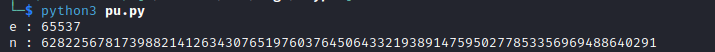
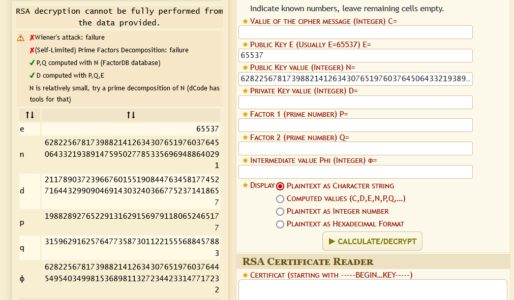
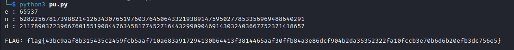

# Crypto

File : [Here](datas/Crypto.zip)

For this challenge, we have the public key key.pub and the key0.enc , key1.enc , key2.enc and key3.enc files

I've written this code to extract the n and the e.

```python
from Crypto.PublicKey import RSA
from Crypto.Util.number import *

pubkey = RSA.importKey(open("key.pub").read())
e = pubkey.e
n = pubkey.n

print("e :", e)
print("n :", n)
```



The n is small, so I factorized it using dcode.



I now have the d.
I wrote this code to decipher the flag.

```python
from Crypto.PublicKey import RSA
from Crypto.Util.number import *

pubkey = RSA.importKey(open("key.pub").read())
e = pubkey.e
n = pubkey.n

flag = ""
d =21178903723966760155190844763458177452716443299090469143032403667752371418657


print("e :", e)
print("n :", n)
print("d :", d)

for _ in ["key0.enc","key1.enc","key2.enc","key3.enc"]:
	with open(_, "rb") as f:
		cipher = f.read()
		c = bytes_to_long(cipher)
		flag += long_to_bytes(pow(c, d, n)).decode()

print(f"\nFLAG: {flag}")

```


