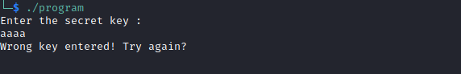
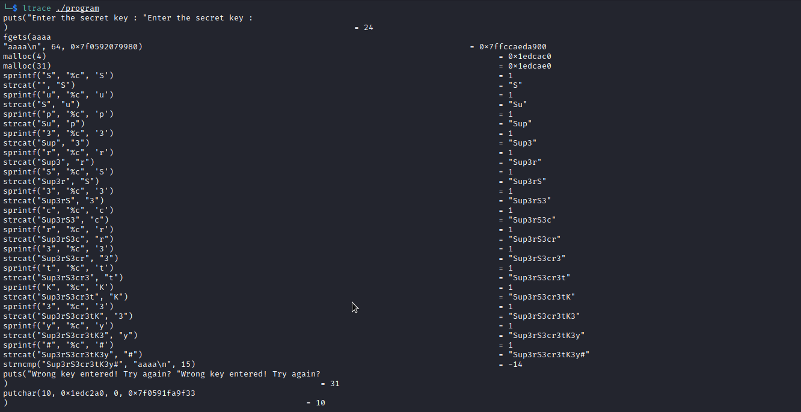
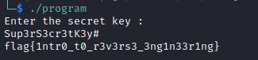

# You are not allowed 

Attached file **[here](datas/program)**

I ran the executable to see how it works and that asks me a secret key.

So I used ltrace to see more clearly, functions called during execution.

As I have the secret key I restart the executable and I put it.

